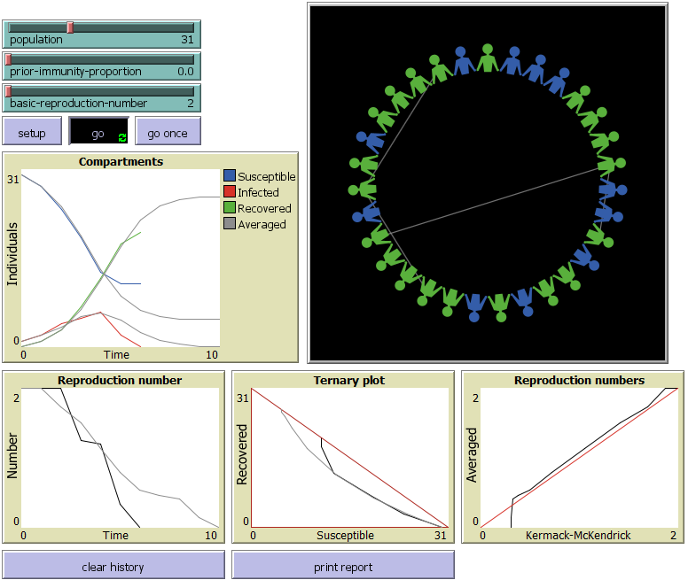
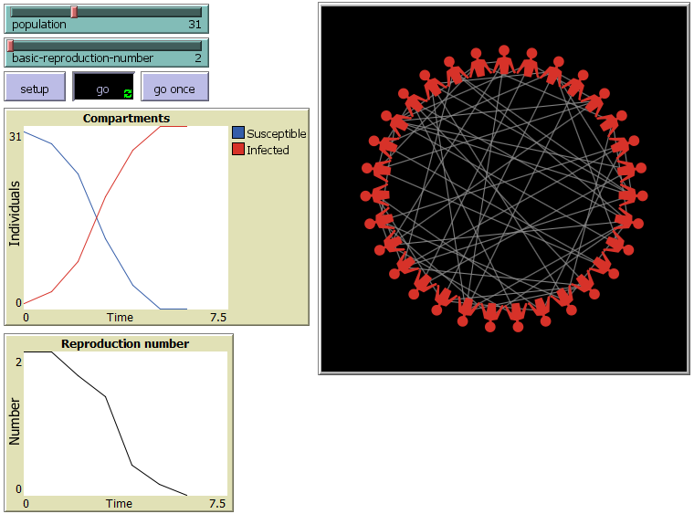
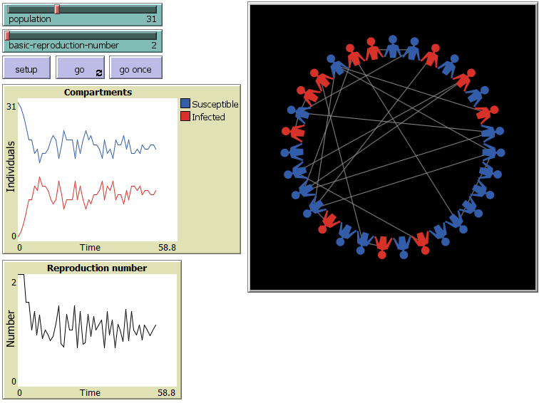

# List of NetLogo models

[NetLogo](https://ccl.northwestern.edu/netlogo/) is a free environment for
Agent Based Modelling.

## Epidemiology

[Minimal SIR model](./Minimal%20SIR.nlogo)

[Run on the web.](https://netlogo-web.org/web?url=https%3A%2F%2Fraw.githubusercontent.com/stochanswers/netlogo/refs/heads/main/Minimal%20SIR.nlogo)

WHAT IS IT?

Do you know how an epidemic grows? One infects two, two infect four or three or two or one or none. All with different probabilities and a weighted average of logistic growth.

The Minimal SIR model is a discrete stochastic compartmental model of an epidemic that averages to the (ordinary differential equation) standard SIR model (Kermack-McKendrick, 1927).
Each individual within a population is in one of three states known, in epidemic modelling, as compartments: 

* S - Susceptible to infection.
* I - Infected and infectious.
* R - Recovered and immune to re-infection.

[Minimal SI model](./Minimal%20SI.nlogo)

[Run on the web.](https://netlogo-web.org/web?url=https%3A%2F%2Fraw.githubusercontent.com/stochanswers/netlogo/refs/heads/main/Minimal%20SI.nlogo)

WHAT IS IT?

Do you know how an epidemic grows? One infects two, two infect four or three or two or one or none. All with different probabilities and a weighted average of logistic growth.

The Minimal SI model is a discrete stochastic compartmental model of an epidemic that averages to the (ordinary differential equation) SI model.
Each individual within a population is in one of two states known, in epidemic modelling, as compartments: 

* S - Susceptible to infection.
* I - Infected and infectious.

[Minimal SIS model](./Minimal%20SIS.nlogo)

[Run on the web.](https://netlogo-web.org/web?url=https%3A%2F%2Fraw.githubusercontent.com/stochanswers/netlogo/refs/heads/main/Minimal%20SIS.nlogo)

WHAT IS IT?

The Minimal SIS model is a discrete stochastic compartmental model of an epidemic that averages to the (ordinary differential equation) SIS model.
Each individual within a population is in one of two states known, in epidemic modelling, as compartments: 

* S - Susceptible to infection.
* I - Infected and infectious.

